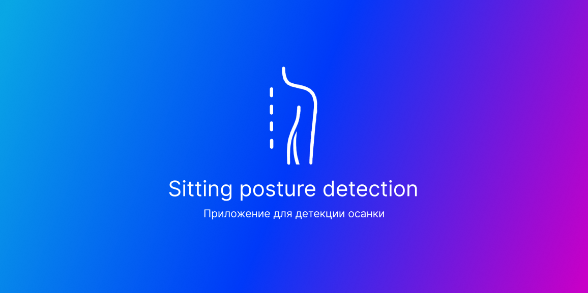
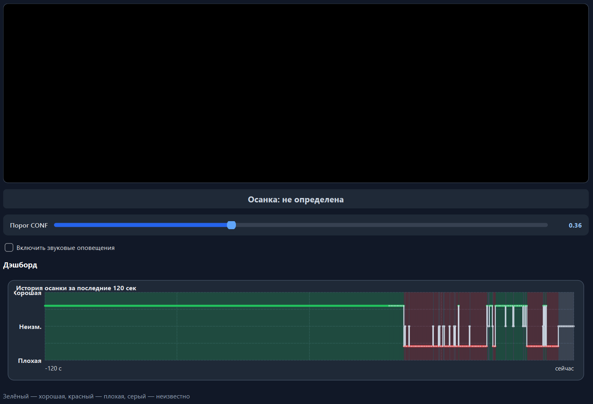

# Sitting posture detection - Приложение для детекции осанки



## 📝 Описание 
При запуске приложение подключается к камере (ВАЖНО: камера должна располагаться сбоку от пользователя и охватывать область от головы до линии сиденья; также необходимо обеспечить хорошее освещение и отсутствие в кадре отвлекающих элементов — это нужно для максимально точного определения осанки) и начинает анализировать позу в реальном времени, если осанка становиться плохой, он обозначает ее красной, хорошей – зеленой. Также если осанка кривая более 3 секунд программа начинает издавать звук чтобы человек исправил ее.

## ⚙️ Установка
1. **Клонируйте репозиторий:**
   ```bash
   git clone https://github.com/ARMEN1357/Sitting-posture-detection.git
   cd Sitting-posture-detection
   ```

и установите также модель из releases, либо сразу скачайте архив с исходным кодом и модель в releases (удобнее если не скачен git)

2. **После установите зависимости**
   ```bash
   pip install ultralytics opencv-python PyQt6
   ```


## 👁️ Скриншот приложения



## 🧠 Реализация

*   **Модель:** yolo26s (дообученная).
*   **Датасет:** 1700+ фотографий (Roboflow + собственноручная разметка).
*   **Обучение:** происходило в Google Colab.

_________________________________________

Приятного использования !
